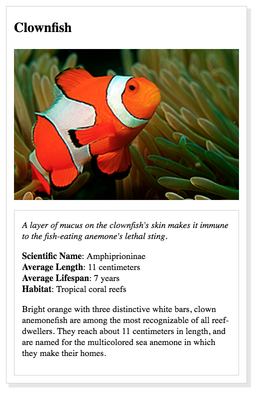
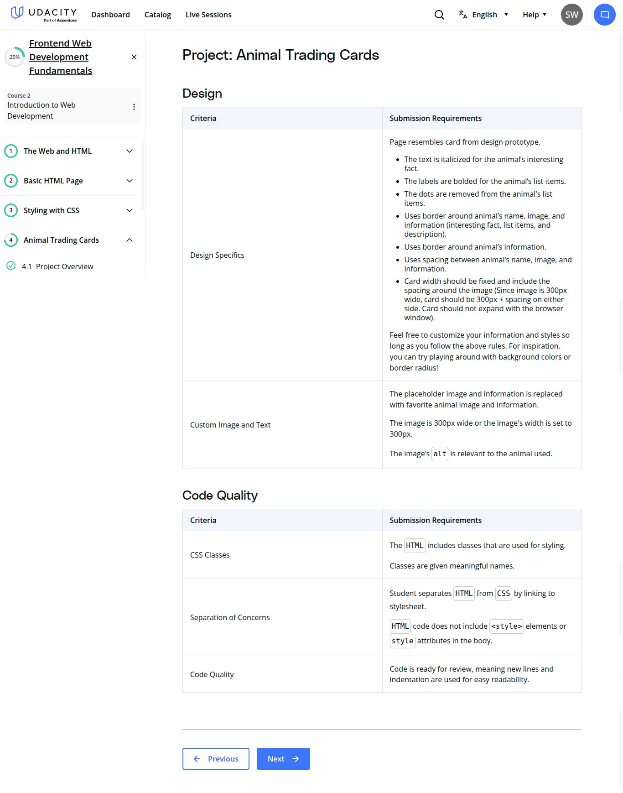

# Project: Animal Trading Card

### 
 Attributions:

Photo by Pia B: https://www.pexels.com/photo/selective-focus-photography-of-octopus-3046629/

### Example Card:

### Grading Rubric:

### 
 Skills Learned from the Animal Trading Card Project:

### 
 1. HTML (HyperText Markup Language)

- Structuring content: You learned how to build the structure of a web page using semantic elements like:
    - &lt;div&gt;, &lt;img&gt;, &lt;h1&gt;, &lt;p&gt;, &lt;ul&gt;, &lt;li&gt;, etc.
- Using attributes:
    - <code>src</code>, <code>alt</code>, <code>class</code>, and <code>id</code> to give meaning and functionality to elements.
- Organizing content hierarchically to reflect the card's design layout.

### 
 2. CSS (Cascading Style Sheets)

- Styling HTML elements:
    - Changed colors, fonts, spacing, and layout to match the design prototype.
- Box Model concepts:
    - Used margin, padding, border, and width/height effectively.
- Typography:
    - Styled text using <code>font-family</code>, <code>font-size</code>, <code>font-weight</code>, and <code>text-align</code>.
- Layout techniques:
    - Used **flexbox** or **block-level** styling to align and position elements correctly.
- Classes:
    - Applied reusable and targeted styles to specific parts of the card.
- Backgrounds and borders:
    - Customized the appearance of containers with background colors, borders, and border-radius for rounded corners.

### 
 3.  Project-Based Thinking

- **Interpreting a design prototype** and translating it into code.
- **Debugging and refining styles** to match a visual goal.
- **Creativity and customization** by choosing your own animal and adjusting the design accordingly.

### 
Final Thoughts:

Working on this CSS project gave me hands-on experience with the essential building blocks of web styling. By starting with a clean slate using the universal selector (*), I learned the importance of resetting default styles to ensure consistency across browsers.

I practiced using the Box Model by controlling spacing through padding, margin, and border, particularly within the .card and .content containers. The structured layout using flexbox in the body and .card helped me center content and stack elements vertically, which made the page both clean and readable.

Typography was a key focus. I used Google Fonts to incorporate "Raleway" and "Open Sans," learning how font selection impacts design tone. Styling elements like &lt;h3&gt;, &lt;span&gt;, and .italic gave me a better understanding of font size, weight, and emphasis.

I also explored visual enhancements through the use of border-radius for rounded corners, box-shadow for depth, and thoughtful color choices that gave the card personality. The consistent styling of the image and card components showed how classes allow reusable, modular design.

Interpreting a design goal and transforming it into code helped sharpen my eye for detail and layout accuracy. I also improved my ability to debug visual issues and make creative decisions—like choosing the animal, colors, and fonts—to give the page a unique touch.

Overall, this project solidified my understanding of CSS as a tool for turning structure into style, and gave me the confidence to create visually polished, professional-looking components.

